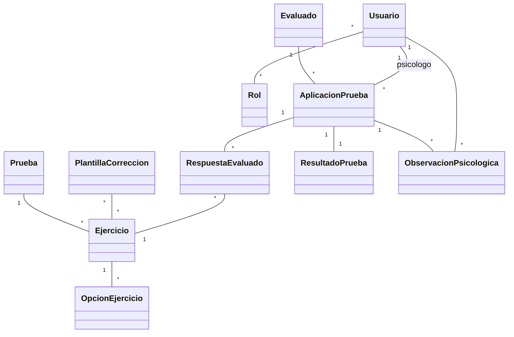
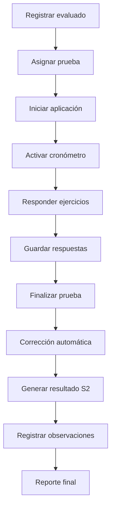
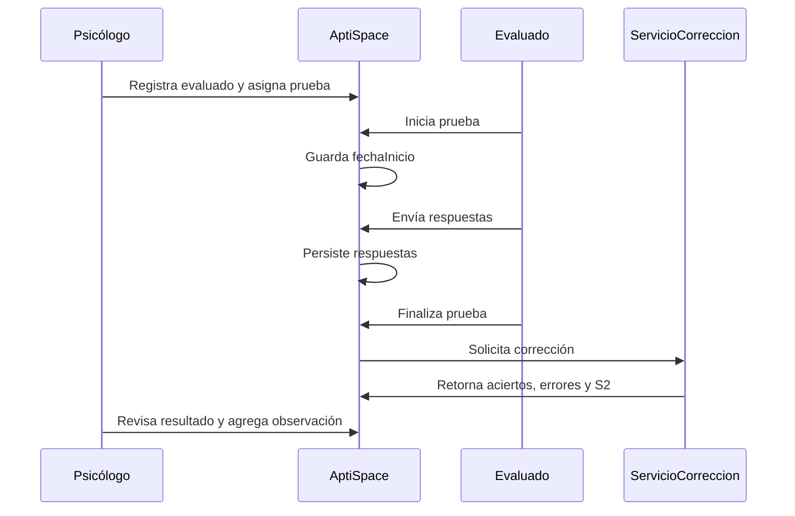
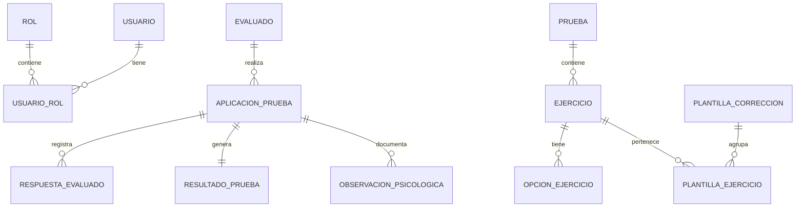

# AptiSpace

Sistema de Evaluación de Aptitud Espacial - Desplazamiento para la administración, aplicación, corrección y reporte del factor espacial S2 de la BFA.

## Objetivo general
Diseñar e implementar un sistema web profesional que permita a psicólogos y evaluadores gestionar evaluados, aplicar la prueba Espacial - Desplazamiento, corregir respuestas automáticamente y generar resultados clínicos y académicos trazables.

## Objetivos específicos
- Gestionar usuarios con roles de administrador, psicólogo y evaluado.
- Registrar evaluados con datos personales, académicos y profesionales.
- Administrar pruebas, ejercicios, opciones y plantillas de corrección.
- Aplicar el test con control de tiempo y selección múltiple.
- Calcular S2 mediante la fórmula S2 = aciertos - errores, con mínimo cero.
- Conservar historial de aplicaciones, respuestas, resultados y observaciones.
- Emitir reportes de resultados para revisión psicológica.

## Alcance
Incluye gestión de usuarios, evaluados, pruebas, aplicación, corrección automática, resultados, observaciones psicológicas, historial y base PostgreSQL. No incluye baremos clínicos normativos propietarios ni interpretación diagnóstica automatizada.

## Justificación
La aplicación manual de pruebas espaciales consume tiempo, aumenta el riesgo de errores de corrección y dificulta el seguimiento histórico. AptiSpace digitaliza el proceso, mejora la trazabilidad y entrega resultados consistentes para evaluación psicológica y orientación vocacional.

## Problema que resuelve
Reduce errores de registro y corrección, centraliza historiales y permite que el psicólogo se enfoque en análisis e interpretación profesional.

## Beneficios
- Corrección automática y consistente.
- Historial completo de cada evaluado.
- Observaciones profesionales vinculadas al resultado.
- Administración flexible de ejercicios y plantillas.
- Preparado para PostgreSQL y despliegue web.

## Requerimientos funcionales
- Gestión de usuarios y roles.
- Gestión de evaluados.
- Gestión de pruebas, ejercicios y opciones.
- Asignación y aplicación de pruebas.
- Cronómetro mediante fechaInicio, fechaFin y tiempoUtilizado.
- Selección múltiple A, B, C, D y E.
- Corrección automática.
- Resultados e historial.
- Observaciones psicológicas.
- Reportes consultables desde módulos OpenXava.

## Requerimientos no funcionales
- Seguridad por roles y sesiones.
- Integridad referencial en JPA y PostgreSQL.
- Rendimiento adecuado para consultas por evaluado, prueba y fecha.
- Disponibilidad en servidor web Java.
- Facilidad de uso mediante módulos OpenXava.
- Escalabilidad por separación de catálogo, aplicación y resultado.

## Tipos de usuario
Administrador: gestiona usuarios, roles, pruebas, configuraciones y reportes globales.
Psicólogo: registra evaluados, asigna pruebas, supervisa evaluaciones, revisa resultados y registra observaciones.
Evaluado: realiza la prueba y consulta únicamente resultados autorizados.

## Flujo del sistema
1. Administrador crea usuarios y roles.
2. Psicólogo registra evaluado.
3. Psicólogo asigna prueba.
4. Evaluado inicia prueba.
5. Sistema registra fecha de inicio.
6. Evaluado responde ejercicios.
7. Sistema guarda respuestas.
8. Sistema finaliza prueba y calcula tiempo.
9. Sistema corrige automáticamente.
10. Psicólogo revisa resultados.
11. Psicólogo registra observaciones.
12. Sistema deja historial y reporte final.

## Reglas de negocio
- Un evaluado no debe repetir la misma prueba sin autorización de reaplicación.
- La prueba tiene tiempo límite configurable.
- Al finalizar, se registra fechaFin y tiempoUtilizado.
- Las preguntas permiten múltiples respuestas correctas.
- El sistema calcula S2 = aciertos - errores.
- Si S2 es negativo, se guarda S2 = 0.
- Debe almacenarse historial completo.

## Diagrama de casos de uso
```mermaid
usecaseDiagram
actor Administrador
actor Psicologo
actor Evaluado
Administrador --> (Gestionar usuarios)
Administrador --> (Gestionar pruebas)
Administrador --> (Consultar reportes globales)
Psicologo --> (Registrar evaluados)
Psicologo --> (Asignar prueba)
Psicologo --> (Supervisar evaluación)
Psicologo --> (Consultar resultados)
Psicologo --> (Agregar observaciones)
Psicologo --> (Generar reporte)
Evaluado --> (Realizar prueba)
Evaluado --> (Consultar resultado autorizado)
```

## Diagrama de clases


## Diagrama de actividades


## Diagrama de secuencia


## Diagrama entidad relación


## Pantallas propuestas
- Login.
- Dashboard principal con aplicaciones recientes y resultados.
- Registro de evaluados.
- Gestión de prueba, ejercicios y opciones.
- Aplicación de prueba con cronómetro y selección múltiple.
- Resultados con aciertos, errores, sin responder y S2.
- Reportes por evaluado, fecha y prueba.
- Administración de usuarios, roles y configuración.
